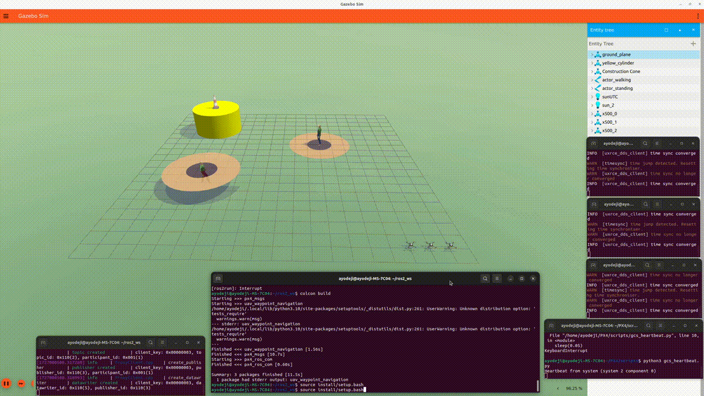

# mhmr-ros-gazebo-simulation
High fidelity simulation of multiple human multiple robots systems using ROS 2 (Humble Hawksbill) LTS and Gazebo Fortress (Ignition Fortress) LTS on Ubuntu 22.04.3 LTS (Jammy Jellyfish)

<kbd></kbd>

Install PX4 following the PX4 install tutorial
Install the  Micro XRCE-DDS Agent following the XRCE-DDS agent tutorial

Install the ROS 2 waypoint processor node. Copy the ros2_ws workspace folder to the home directory, build, and run waypoint navigation program as follows

```console
$ source /opt/ros/humble/setup.bash
$ cd ~/ros2_ws
$ colcon build
```


Open the first terminal
```console
$ cd ~/PX4/PX4-Autopilot
$ MicroXRCEAgent udp4 -p 8888
```

Open a second terminal to start the Micro XRCE-DDS Agent
```console
$ make px4_sitl gz_x500
```

Open a third terminal to run the GCS heartbeat script
```console
$ python3 gcs_heartbeat.py
```

Download gcs_heartbeat.py from the github repo, place it in any folder. It can be run from any folder.

Open the fourth terminal to run the waypoint navigator node
```console
$ source /opt/ros/humble/setup.bash
$ cd ~/ros2_ws
$ colcon build
$ source install/setup.bash
# ros2 run uav_waypoint_navigation uav_waypoint_navigation
$ ros2 run uav_waypoint_navigation uav_waypoint_navigator 0 0 0 -5 5 0 -5 5 5 -5 0 5 -5
```

clean/rebuild workspace
$ rm -rf build/ install/ log/
$ colcon build

Creating and adding new world

I generate a custom world file “my_custom_world.sdf” and copied into PX4-Autopilot/Tools/simulation/gz/worlds directory
Open cmake file src/modules/simulation/gz_bridge/CMakeLists.txt 3
Add my_custom_world by appending below set(gz_worlds * ) section.
Then in one terminal run PX4_GZ_WORLD=my_custom_world make px4_sitl gz_x500
Also open QGroundControl
By the way a work around I copied the contents of default.sdf world into mine, append my customizaton models. And dont forget to replace world name inside custom world SDF file.

Clone the PX4-Autopilot repo and check out v1.14
Place a custom world model custom.sdf in PX4-Autopilot/Tools/simulation/gz/worlds/
run the simulation using PX4_GZ_WORLD=custom make px4_sitl gz_x500

mhmr
mhmr_lawn

-----
PX4_SYS_AUTOSTART=4001 PX4_GZ_WORLD=mhmr_lawn PX4_GZ_MODEL_POSE="-7,-7" PX4_SIM_MODEL=gz_x500  ./build/px4_sitl_default/bin/px4 -i 0
% PX4_SYS_AUTOSTART=4001 PX4_SIM_MODEL=gz_x500 PX4_GZ_WORLD=mhmr ./build/px4_sitl_default/bin/px4 -i 1
PX4_SYS_AUTOSTART=4001 PX4_GZ_MODEL_POSE="-8,-6" PX4_SIM_MODEL=gz_x500 ./build/px4_sitl_default/bin/px4 -i 1
PX4_SYS_AUTOSTART=4001 PX4_GZ_MODEL_POSE="-8,-8" PX4_SIM_MODEL=gz_x500 ./build/px4_sitl_default/bin/px4 -i 2

% uav1 position -9,-9
% uav1 position -9,-8
% uav1 position -9,-7

commander takeoff

commander land

commander status

-----------------
% uav_waypoint_navigation.py <uav_id> <x1> <y1> <z1> [<x2> <y2> <z2> ...]
ros2 run uav_waypoint_navigation uav_waypoint_navigation 0 0 0 -5 5 0 -5 5 5 -5 0 5 -5
ros2 run uav_waypoint_navigation uav_waypoint_navigation 1 0 0 -5 5 0 -5 5 5 -5 0 5 -5
ros2 run uav_waypoint_navigation uav_waypoint_navigation 2 0 0 -5 5 0 -5 5 5 -5 0 5 -5
ros2 run uav_waypoint_navigation uav_waypoint_navigation 3 0 0 -5 5 0 -5 5 5 -5 0 5 -5


run marl inference and fetch waypoint
```console
$ source /opt/ros/humble/setup.bash
$ cd ~/ros2_ws
$ colcon build
$ source install/setup.bash
$ ros2 run uav_waypoint_navigation uav_waypoint_processor_marl
```


